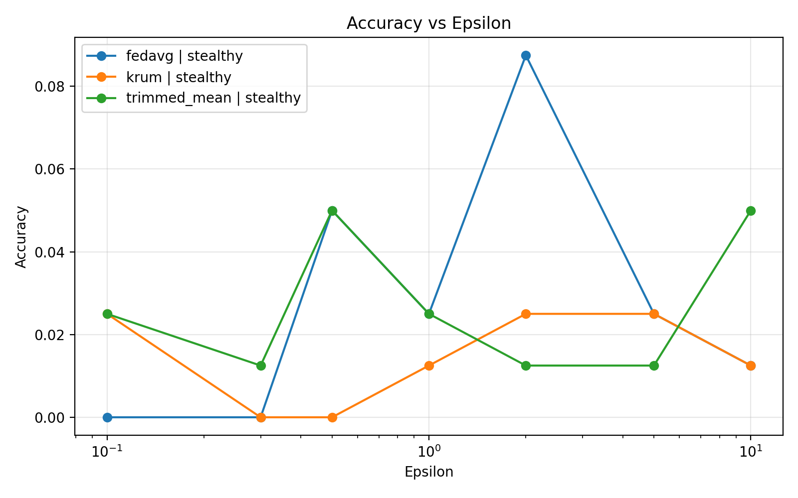
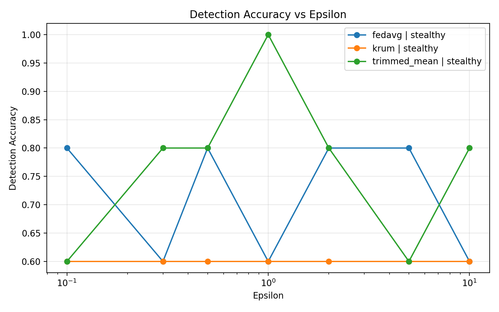
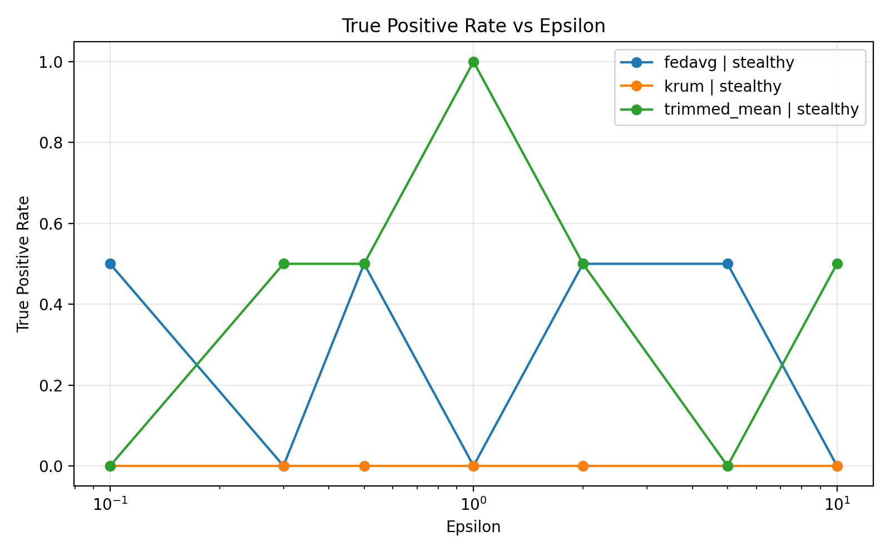

# The Security Paradox in Federated Learning: Analyzing the Impact of Differential Privacy Noise on Poisoning Attack Detection 

Ky projekt demonstron nje paradoks te rendesishem ne Federated Learning: sa me shume privacy te shtojme me Differential Privacy, aq me e veshtire mund te behet ruajtja e performances se modelit dhe zbulimi i klienteve keqdashes.

Ne kete implementim kam ndertuar nje eksperiment te vogel mbi FEMNIST ku:
- disa kliente trajnojne modelin lokalisht,
- nje pjese e tyre simulohen si kliente malicious,
- update-et e tyre privatizohen me Differential Privacy,
- serveri provon t'i detektoje klientet e dyshimte,
- dhe krahasohen disa metoda agregimi.

Qellimi kryesor i punes eshte te shihet si ndikon vlera e `epsilon` ne:
- performancen e modelit,
- qendrueshmerine ndaj sulmeve,
- dhe saktesine e zbulimit te klienteve malicious.

## Ideja kryesore

Federated Learning lejon trajnimin e modelit pa i derguar te dhenat e klienteve ne server. Ne vend te te dhenave, klientet dergojne vetem `model updates`.

Kjo ndihmon privatësine, por edhe krijon nje hapesire ku nje klient malicious mund te dergoje update te manipuluar. Nese ne te njejten kohe shtojme edhe Differential Privacy, atehere update-et behen me te zhurmshme. Kjo zhurme mund te mbroje privatësine, por mund ta veshtiresoje:
- mesimin e modelit global,
- dallimin mes update-eve normale dhe atyre te sulmuara.

Pra, projekti po ilustron pikerisht kete paradoks: me shume privatësi jo gjithmone do te thote me shume siguri.

## Struktura e projektit

- `main.py`: pika hyrëse e projektit
- `src/experiment.py`: pipeline kryesor i eksperimentit
- `src/data_loader.py`: leximi i FEMNIST JSON dhe krijimi i `DataLoader`
- `src/model.py`: modeli `FemnistMLP`
- `src/federated.py`: trajnim lokal, llogaritje e update-it, evaluim
- `src/attacks.py`: simulimi i sulmeve
- `src/privacy.py`: clipping dhe shtimi i DP noise
- `src/aggregation.py`: `FedAvg`, `Trimmed Mean`, `Krum`
- `scripts/build_femnist_sample.py`: krijimi i dataset-it te vogel nga FEMNIST
- `scripts/run_epsilon_sweep.py`: ekzekutimi i eksperimenteve per disa vlera te `epsilon`
- `scripts/plot_results.py`: krijimi i tabeles permbledhese dhe grafikave
- `results/`: rezultatet e ruajtura nga ekzekutimet

## Te dhenat

Projekti perdor nje sample te vogel te FEMNIST ne format JSON.

Dataset-i i krijuar ne kete projekt ndodhet te:
- `femnist/data/sample_small/train/sampled_small_train.json`
- `femnist/data/sample_small/test/sampled_small_test.json`
- `femnist/data/sample_small/sample_summary.json`

Sipas `sample_summary.json`, sample-i i perdorur ka:
- `10` writers / kliente
- maksimumi `40` imazhe per klient
- `320` mostra train
- `80` mostra test

Ky dataset i vogel eshte i pershtatshem per demonstrim, proof of work dhe analizim te sjelljes se metodave pa pasur kosto te madhe ekzekutimi.

## Si eshte ndertuar dataset-i

Skripta `scripts/build_femnist_sample.py` e ben kete pune:

1. Merr disa writer-a nga FEMNIST.
2. Kufizon numrin e imazheve per secilin writer.
3. Normalizon secilin imazh ne grayscale `28x28`.
4. E shnderron imazhin ne vektor me `784` vlera.
5. I vendos etiketat e klasave ne format numerik.
6. E ndan dataset-in ne `train` dhe `test`.
7. I ruan rezultatet ne JSON.

Komanda tipike eshte:

```powershell
python scripts/build_femnist_sample.py `
  --by-write-zip <path-to-by_write.zip> `
  --by-class-zip femnist/data/raw_data/by_class.zip `
  --out-dir femnist/data/sample_small `
  --num-writers 10 `
  --max-images-per-writer 40 `
  --train-frac 0.8 `
  --seed 42
```

Shenim: ne workspace-in aktual ekziston `by_class.zip`, ndersa `by_write.zip` nuk eshte i ruajtur me, por JSON-at e sample-it tashme jane krijuar.

## Modeli

Modeli i perdorur eshte nje `MLP` i thjeshte te `src/model.py`.

Arkitektura:
- hyrja: `28 * 28 = 784`
- hidden layer 1: `256`
- hidden layer 2: `128`
- dalja: `62` klasa

Ky model nuk eshte zgjedhur per te arritur accuracy te larte absolute, por per te krijuar nje setup te qarte ku mund te vihen re efektet e privacy dhe sulmeve.

## Si funksionon eksperimenti

Logjika kryesore eshte te `src/experiment.py`.

Per secilin round ndodh kjo rrjedhe:

1. Ngarkohet data e secilit klient.
2. Zgjidhen klientet malicious sipas `malicious_fraction`.
3. Cdo klient trajnon nje kopje lokale te modelit global.
4. Llogaritet `update` i secilit klient.
5. Nese klienti eshte malicious, update-i i tij manipulohet.
6. Mbi cdo update aplikohet Differential Privacy.
7. Serveri provon te detektoje klientet e dyshimte.
8. Update-et agregohen me metoden e zgjedhur.
9. Perditesohet modeli global.
10. Vleresohet modeli ne test set.
11. Llogariten metrikat e detektimit.
12. Rezultatet ruhen ne JSON.

Kjo rrjedhe perseritet per numrin e `rounds`.

## Komponentet kryesore te kodit

### 1. Ngarkimi i te dhenave

`src/data_loader.py`:
- lexon JSON-at e FEMNIST,
- krijon nje `TensorDataset` per secilin klient,
- krijon `DataLoader` lokal per trajnim,
- dhe nje `DataLoader` global per testim.

Kjo e ben te mundur simulimin e Federated Learning, ku secili klient ka te dhena te ndara nga te tjeret.

### 2. Trajnimi federativ

`src/federated.py`:
- `train_local_model(...)`: trajnon modelin te secili klient
- `compute_model_update(...)`: llogarit ndryshimin mes modelit global dhe atij lokal
- `apply_global_update(...)`: e aplikon update-in e agreguar ne modelin global
- `evaluate_model(...)`: llogarit `loss` dhe `accuracy`

Pra, ne server nuk dergohet dataset-i i klientit, por vetem update-i i modelit.

### 3. Sulmet

`src/attacks.py` suporton:
- `none`: pa sulm
- `aggressive`: update-i kthehet ne drejtim te kundert me force me te madhe
- `stealthy`: update-i manipulohet me ndryshim te vogel qe te mos dallohet lehte

Ne sweep-in kryesor te ketij projekti eshte perdorur sulmi `stealthy`, sepse ai e ilustron me mire nje sulm realist qe tenton te mos duket.

### 4. Differential Privacy

`src/privacy.py` ben dy hapa:

1. `clip_update(...)`
   Kufizon normen e update-it qe asnje klient te mos kete ndikim te pakontrolluar.

2. `add_dp_noise(...)`
   Shton Gaussian noise mbi update-in e klientit.

Lidhja me `epsilon`:
- `epsilon` i vogel = me shume noise = me shume privatësi
- `epsilon` i madh = me pak noise = me pak privatësi

Kjo eshte pikerisht variabla qe testohet ne eksperiment.

### 5. Agregimi

`src/aggregation.py` implementon tre metoda:

- `FedAvg`
  Ben mesataren klasike te update-eve.

- `Trimmed Mean`
  Heq update-et ekstreme para se te llogarise mesataren. Kjo e ben me robust ndaj outliers dhe sulmeve.

- `Krum`
  Zgjedh update-in qe eshte me afer me pjesen me te madhe te update-eve te tjera.

Keto tri metoda krahasohen per te pare cila mban me mire balancen mes performances dhe sigurise.

### 6. Detektimi i klienteve malicious

`src/experiment.py` perdor distance-based detection:
- per `Krum` perdoren `krum_scores`
- per `FedAvg` dhe `Trimmed Mean` perdoret distanca nga qendra e update-eve

Klientet me devijimin me te madh konsiderohen me te dyshimte.

## Parametrat kryesore

Parametrat e rendesishem ne `main.py` / `src/experiment.py` jane:

- `--train-path`
  Rruga e train dataset

- `--test-path`
  Rruga e test dataset

- `--aggregation`
  Zgjedh metoden e agregimit: `fedavg`, `trimmed_mean`, `krum`

- `--epsilon`
  Kontrollon sasine e DP noise

- `--attack-type`
  `none`, `aggressive`, `stealthy`

- `--attack-strength`
  Sa i forte eshte sulmi

- `--rounds`
  Sa here perseritet komunikimi federativ mes klienteve dhe serverit

- `--local-epochs`
  Sa epoka trajnon secili klient ne dataset-in e vet lokal

- `--batch-size`
  Madhesia e batch-it

- `--learning-rate`
  Tregon sa shpejt meson modeli ne secilin klient gjate trajnimit lokal

- `--malicious-fraction`
  Perqindja e klienteve malicious

- `--seed`
  Per riprodhueshmeri

- `--device`
  `cpu` ose `cuda`

- `--output`
  Ku ruhet rezultati i run-it

## Rendi i ekzekutimit

Nese projekti ekzekutohet prej fillimit, rendi logjik eshte ky:

### 1. Instalimi i paketave

```powershell
pip install -r requirements.txt
```

### 2. Krijimi i sample-it nga FEMNIST

```powershell
python scripts/build_femnist_sample.py `
  --by-write-zip <path-to-by_write.zip> `
  --by-class-zip femnist/data/raw_data/by_class.zip `
  --out-dir femnist/data/sample_small `
  --num-writers 10 `
  --max-images-per-writer 40 `
  --train-frac 0.8 `
  --seed 42
```

### 3. Nje prove e shpejte

```powershell
python main.py `
  --aggregation fedavg `
  --epsilon 1.0 `
  --attack-type none `
  --rounds 1 `
  --output results/smoke_test.json
```

Kjo sherben vetem per te pare nese pipeline punon nga fillimi ne fund.

### 4. Nje run i vetem me sulm

```powershell
python main.py `
  --aggregation fedavg `
  --epsilon 1.0 `
  --attack-type stealthy `
  --attack-strength 3.0 `
  --rounds 3 `
  --output results/single_run.json
```

### 5. Sweep per disa vlera te `epsilon`

```powershell
python scripts/run_epsilon_sweep.py --output-dir results/sweeps_full
```

Kjo skripte i ekzekuton automatikisht te gjitha kombinimet e nevojshme. Ne kete projekt ajo ka prodhuar run-et qe figurojne te `results/sweeps_full/manifest.json`.

### 6. Krijimi i grafikave dhe tabeles permbledhese

```powershell
python scripts/plot_results.py `
  --results-dir results/sweeps_full `
  --plots-dir results/plots_full `
  --summary-csv results/plots_full/summary.csv
```

## Cfare eshte ekzekutuar ne kete projekt

Nga rezultatet ekzistuese ne `results/`, sweep-i kryesor eshte bere me kete ide:

- agregime:
  - `fedavg`
  - `krum`
  - `trimmed_mean`

- sulm:
  - `stealthy`

- vlera te `epsilon`:
  - `0.1`
  - `0.3`
  - `0.5`
  - `1.0`
  - `2.0`
  - `5.0`
  - `10.0`

- raunde:
  - `3`

- local epochs:
  - `1`

- malicious fraction:
  - `0.2`

Pra, jane krahasuar 3 metoda agregimi nen nje sulm te fshehte, duke ndryshuar vetem nivelin e privatësise.

## Metrikat qe maten

Per secilin run ruhen:

- `loss`
  Humbja e modelit ne test set

- `accuracy`
  Saktesia e modelit ne test set

- `detection_accuracy`
  Sa sakte jane klasifikuar klientet si normal ose malicious

- `false_positive_rate`
  Sa kliente normal jane shenuar gabimisht si malicious

- `true_positive_rate`
  Sa kliente malicious jane kapur me sukses

- `false_negative_rate`
  Sa kliente malicious kane shpetuar pa u zbuluar

## Rezultatet kryesore

Rezultatet permbledhese gjenden te:
- `results/plots_full/summary.csv`
- `results/plots_full/*.png`

Per ta bere README me te qarte edhe vizualisht, me poshte jane perfshire disa nga grafikat kryesore te gjeneruara nga eksperimentet.

### Grafikat kryesore

#### Accuracy vs Epsilon

Ky grafik tregon si ndryshon performanca e modelit kur ndryshohet niveli i privatësise.



#### Detection Accuracy vs Epsilon

Ky grafik tregon sa mire arrin sistemi t'i dalloj klientet normal nga klientet malicious.



#### True Positive Rate vs Epsilon

Ky grafik tregon sa nga klientet malicious arrihen te zbulohen realisht.



Nga rezultatet del kjo tablo:

### 1. Kur `epsilon` eshte i vogel, performanca bie shume

Per vlera si `0.1` dhe `0.3`, `loss` rritet ne menyre ekstreme dhe `accuracy` shkon pothuajse ne zero. Kjo tregon se zhurma e Differential Privacy po e demton fuqishem mesimin e modelit.

### 2. Sulmi `stealthy` nuk kapet gjithmone lehte

Ne shume raste `true_positive_rate` eshte `0.0` ose `0.5`, qe do te thote se ose nuk kapet asnje klient malicious, ose kapet vetem gjysma e tyre.

### 3. `Trimmed Mean` doli me robust ne kete setup

Ne rezultatet e ruajtura, `trimmed_mean` jep sjelljen me te mire ne disa pika kritike. Shembulli me i qarte eshte `epsilon = 1.0`, ku ne round-in final u arrit:

- `detection_accuracy = 1.0`
- `false_positive_rate = 0.0`
- `true_positive_rate = 1.0`
- `false_negative_rate = 0.0`

Kjo do te thote se ne ate run:
- u kapen te gjithe klientet malicious,
- nuk u akuzua gabimisht asnje klient normal.

### 4. `Krum` ne kete eksperiment nuk performoi mire

Ne kete setup te vogel, `krum` pati accuracy te ulet dhe `true_positive_rate` te dobet ne fund te run-eve. Kjo tregon se jo cdo metode robuste sillet mire ne cdo konfigurim te vogel eksperimental.

### 5. Ne kete konfigurim duket se ekziston nje vlere me e balancuar e `epsilon`

Rezultatet sugjerojne se ne kete eksperiment nuk ishte zgjidhje e mire as nje `epsilon` shume i vogel dhe as nje `epsilon` shume i madh. Kur `epsilon` ishte shume i vogel, zhurma e DP e demtonte rende performancen e modelit. Ndersa kur `epsilon` rritej shume, privatësia dobesohej pa dhene domosdoshmerisht permiresimin me te mire ne zbulim.

Ne kete setup, `epsilon = 1.0` me `trimmed_mean` del si pika me e balancuar, sepse ofroi kompromisin me te mire mes privatësise, performances se modelit dhe zbulimit te klienteve malicious.

## Si mund te interpretohen rezultatet

Mesazhi kryesor i ketij projekti eshte:

Sa me shume noise te shtojme per privatësi, aq me shume mund te humbasim ne performancen e modelit dhe ne aftesine per te dalluar sjelljen keqdashes. Pra, ekziston nje trade-off real mes privatësise dhe sigurise ne Federated Learning.

Ne kete projekt:
- privatësia kontrollohet me `epsilon`,
- siguria testohet me sulm `stealthy`,
- robustesia e serverit testohet me `FedAvg`, `Trimmed Mean` dhe `Krum`.

Per me teper, rezultatet tregojne se ne kete konfigurim duket se ekziston edhe nje vlere me e balancuar e `epsilon`, ku ruhet nje kompromis me i mire mes privatësise, performances dhe detektimit. Ne eksperimentet e realizuara, kjo pike u vu re me se qarti te `epsilon = 1.0` me `trimmed_mean`.

## Kufizimet e ketij implementimi

Ky implementim eshte menduar si eksperiment demonstrues dhe jo si sistem production-ready. Disa kufizime te vetedijshme jane:

- dataset i vogel
- model i thjeshte MLP
- vetem nje fraction e vogel klienteve
- nje numer i vogel raundesh
- nje mekanizem relativisht i thjeshte detektimi

Megjithate, pikerisht kjo thjeshtesi e ben eksperimentin te qarte per analizim dhe per prezantim akademik.

## Permbledhje finale

Ne kete projekt kemi realizuar nje pipeline te plote eksperimental per te studiuar lidhjen mes privatësise dhe sigurise ne Federated Learning.

Kemi:
- pergatitur nje sample te FEMNIST,
- ndertuar trajnim federativ me kliente lokal,
- simuluar kliente malicious,
- shtuar Differential Privacy ne update-et e klienteve,
- krahasuar tre metoda agregimi,
- matur performancen e modelit dhe saktesine e detektimit,
- dhe gjeneruar rezultate krahasuese per disa vlera te `epsilon`.

Rezultatet tregojne se ulja e `epsilon` rrit privatësine, por ne te njejten kohe e demton performancen dhe mund ta veshtiresoje zbulimin e sulmeve. Ne kete setup, `Trimmed Mean` doli metoda me premtuese nder tri metodat e testuara.
